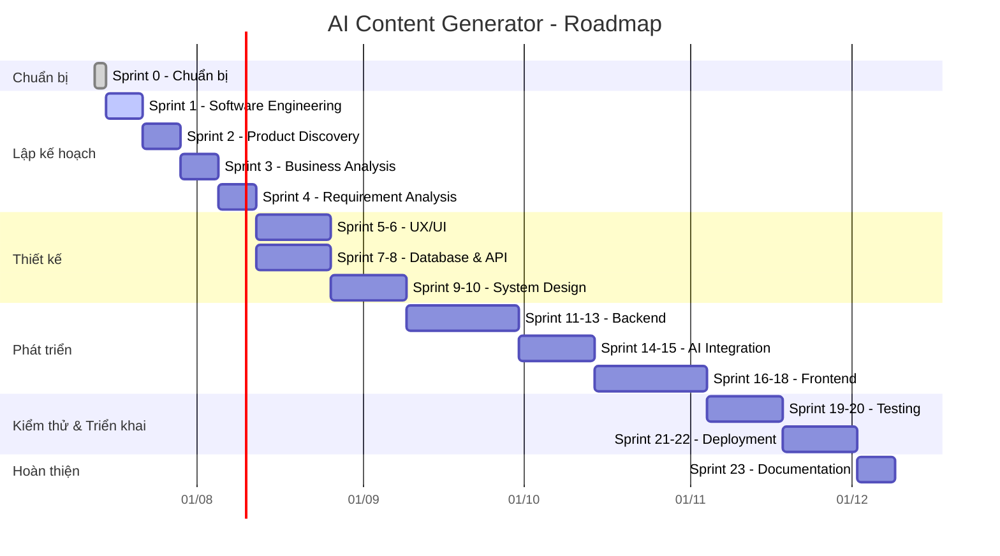
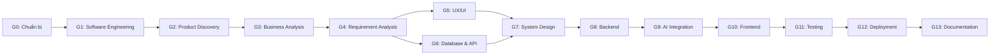

# AI Content Generator - Roadmap

## Tổng quan

- **Dự án**: AI Content Generator
- **Thời gian**: 24 tuần (~6 tháng)
- **Phương pháp**: Agile / Scrum
- **Sprint**: 24 sprints (Sprint 0 → Sprint 23)

---

## Timeline

---

## Chi tiết các giai đoạn

### Giai đoạn 0 — Chuẩn bị (2 ngày)
| Hạng mục | Chi tiết |
|---|---|
| **Mục tiêu** | Thiết lập đầy đủ môi trường phát triển và công cụ |
| **Git** | Cài đặt, tạo repo, học commit/push/pull/branch cơ bản |
| **GitHub** | Tạo repository, viết README, quản lý remote |
| **VS Code** | Cài extension (Markdown, Git, Prettier), làm quen terminal |
| **IntelliJ IDEA** | Cài Community Edition, cấu hình SDK |
| **Database** | Cài MySQL/PostgreSQL + DBeaver |
| **Postman** | Cài đặt, làm quen với collection/request |
| **Docker** | Cài Docker Desktop (chỉ cài, học sau) |
| **Figma** | Tạo tài khoản, làm quen giao diện |
| **Deliverables** | Repository GitHub sẵn sàng, checklist hoàn thành |
| **DoD** | Tất cả công cụ đã cài và cấu hình thành công |

### Giai đoạn 1 — Software Engineering (1 tuần)
| Hạng mục | Chi tiết |
|---|---|
| **Mục tiêu** | Hiểu SDLC, Agile, Scrum để áp dụng vào dự án |
| **SDLC** | Các giai đoạn, deliverables, vai trò từng phase |
| **Agile** | Manifesto, 12 principles, mindset |
| **Scrum** | Sprint, Product Backlog, Sprint Backlog, Daily Scrum, Review, Retrospective |
| **Kanban** | Board, WIP, Continuous Delivery |
| **Git Flow** | Main, Develop, Feature, Release, Hotfix branches |
| **Tài liệu** | Scrum Guide, Atlassian SDLC, Agile Guide |
| **Thực hành** | Viết ghi chú, tạo Roadmap, lập Sprint Plan |
| **Deliverables** | Roadmap, Sprint Plan, ghi chú Software Engineering |
| **DoD** | Hiểu và giải thích được SDLC, phân biệt Scrum/Kanban |

### Giai đoạn 2 — Product Discovery (1 tuần)
| Hạng mục | Chi tiết |
|---|---|
| **Mục tiêu** | Xác định vấn đề, khách hàng, và mô hình kinh doanh |
| **Product Thinking** | Tư duy sản phẩm, problem-solution fit |
| **Market Research** | Nghiên cứu thị trường AI content generation |
| **SWOT** | Điểm mạnh, yếu, cơ hội, thách thức |
| **Lean Canvas** | Problem, Solution, Key Metrics, UVP, Channels |
| **Business Model Canvas** | 9 khối: Customer Segments, Value Propositions, Channels... |
| **Competitor Analysis** | Phân tích đối thủ: Copy.ai, Jasper, Writesonic... |
| **Deliverables** | Vision Document, Competitor Analysis, Lean Canvas, BMC, SWOT |
| **DoD** | Hoàn thành 5 tài liệu, hiểu rõ thị trường và đối thủ |

### Giai đoạn 3 — Business Analysis (1 tuần)
| Hạng mục | Chi tiết |
|---|---|
| **Mục tiêu** | Phân tích nghiệp vụ, xác định actor và luồng nghiệp vụ |
| **Stakeholder** | Danh sách stakeholders, ma trận ảnh hưởng/quan tâm |
| **Persona** | Xây dựng 2-3 persona: content creator, marketer, business owner |
| **User Journey** | Mapping từ lúc user có nhu cầu đến khi có kết quả |
| **User Story** | "As a..., I want..., So that..." format |
| **Use Case** | Use case diagram + mô tả chi tiết từng use case |
| **Deliverables** | BRD, Persona, User Journey, User Story, Use Case |
| **DoD** | BRD được review, tất cả use case được xác định |

### Giai đoạn 4 — Requirement Analysis (1 tuần)
| Hạng mục | Chi tiết |
|---|---|
| **Mục tiêu** | Xác định chi tiết yêu cầu chức năng và phi chức năng |
| **Functional Req** | Đăng nhập, quản lý content, tạo content AI, lịch sử, profile |
| **Non-functional Req** | Hiệu năng (<3s response), bảo mật, scalability, availability |
| **Business Rules** | Giới hạn content, quota, định dạng đầu ra |
| **Acceptance Criteria** | Given/When/Then cho từng user story |
| **Product Backlog** | Ước lượng story points, priority |
| **SRS** | Viết tài liệu đặc tả yêu cầu phần mềm theo IEEE 830 |
| **Deliverables** | SRS, Product Backlog, Acceptance Criteria |
| **DoD** | SRS hoàn chỉnh, backlog được prioritize |

### Giai đoạn 5 — UX/UI (2 tuần)
| Hạng mục | Tuần 1 | Tuần 2 |
|---|---|---|
| **Nội dung** | Information Architecture, Sitemap, User Flow | Design System, Wireframe → Prototype |
| **IA** | Phân loại nội dung, cấu trúc menu, navigation |
| **Sitemap** | Sơ đồ trang web: Home, Dashboard, Generator, History, Profile, Settings |
| **User Flow** | Flow đăng nhập, tạo content, xem lịch sử |
| **Wireframe** | Thiết kế khung cho tất cả màn hình (Lo-fi) |
| **Design System** | Colors (primary/secondary), Typography, Spacing, Components (Button, Input, Card, Modal) |
| **Prototype** | Kết nối các màn hình thành prototype tương tác (Hi-fi) |
| **Responsive** | Thiết kế cho desktop + tablet + mobile |
| **Tools** | Figma |
| **Deliverables** | Sitemap, User Flow, Wireframe, Prototype, Design System |
| **DoD** | Prototype tương tác được review, design system hoàn chỉnh |

### Giai đoạn 6 — Database & API (2 tuần)
| Hạng mục | Tuần 1 (Database) | Tuần 2 (API) |
|---|---|---|
| **Nội dung** | ERD, Data Dictionary, SQL Script | REST API, Swagger, Postman Collection |
| **SQL** | Ôn tập: SELECT, JOIN, CREATE TABLE, INDEX, FOREIGN KEY |
| **ERD** | Xác định entities: User, Content, Category, Template, History |
| **Data Dictionary** | Mô tả từng cột: tên, kiểu, độ dài, ràng buộc, ghi chú |
| **Index** | Thiết kế index cho truy vấn thường xuyên |
| **REST API** | RESTful conventions: GET/POST/PUT/DELETE, status codes |
| **Swagger** | Mô tả API bằng OpenAPI 3.0 |
| **Postman** | Tạo collection, environment variables, test scripts |
| **Auth Flow** | JWT: login → token → refresh → protected routes |
| **Deliverables** | ERD, SQL Script, OpenAPI Spec, Postman Collection |
| **DoD** | Database script chạy được, API spec hoàn chỉnh |

### Giai đoạn 7 — System Design (2 tuần)
| Hạng mục | Tuần 1 (HLD) | Tuần 2 (LLD) |
|---|---|---|
| **Nội dung** | Architecture Diagram, SOLID | Class Diagram, Sequence Diagram, Design Patterns |
| **HLD** | Client-Server, microservices hay monolithic, caching, load balancer |
| **Architecture** | Layers: Presentation → Business → Persistence |
| **SOLID** | Single Responsibility, Open/Closed, Liskov, Interface Segregation, Dependency Inversion |
| **Clean Architecture** | Entities → Use Cases → Interface Adapters → Frameworks |
| **Design Patterns** | Singleton, Factory, Strategy, Observer, Dependency Injection |
| **Class Diagram** | Chi tiết các class, attributes, methods, relationships |
| **Sequence Diagram** | Luồng: login, tạo content, gọi AI API |
| **Deliverables** | HLD document, Architecture Diagram, Class Diagram, Sequence Diagram |
| **DoD** | Kiến trúc được review, diagrams vẽ đầy đủ |

### Giai đoạn 8 — Backend (3 tuần)
| Hạng mục | Tuần 1 | Tuần 2 | Tuần 3 |
|---|---|---|---|
| **Nội dung** | Spring Boot project, Entities, Repositories | Services, DTO, CRUD APIs | Spring Security, JWT, Exception Handling, Logging |
| **Java** | Ôn OOP, Collections, Streams, Optional |
| **Spring Boot** | Init project, application.yml, DevTools, Lombok |
| **JPA** | Entities, Relationships (@OneToMany, @ManyToOne), Repositories |
| **Spring MVC** | Controllers, DTOs, Mappers, Validators |
| **Security** | Spring Security filter chain, JWT token, login/register, role-based |
| **CRUD** | User CRUD, Content CRUD, Category CRUD, Template CRUD |
| **Exception** | Global exception handler (@ControllerAdvice), custom exceptions |
| **Logging** | SLF4J + Logback: log levels, patterns, file appender |
| **Deliverables** | Backend source code, REST APIs hoàn chỉnh, Postman collection |
| **DoD** | All APIs tested via Postman, authentication hoạt động, error handling đúng |

### Giai đoạn 9 — AI Integration (2 tuần)
| Hạng mục | Tuần 1 | Tuần 2 |
|---|---|---|
| **Nội dung** | Prompt Engineering, LLM API integration | Optimize prompts, response handling |
| **Prompt Engineering** | Prompt structure, temperature, max_tokens, top_p, system/user messages |
| **LLM API** | OpenAI API / Gemini API / Claude API: authentication, request/response |
| **Design Prompt** | Template cho từng loại content: quảng cáo, bài viết blog, mô tả sản phẩm, email marketing |
| **Integration** | Service layer gọi LLM, parse response, error handling (rate limit, timeout) |
| **Caching** | Cache response để tránh gọi API trùng prompt |
| **Deliverables** | AI Service module, prompt templates collection |
| **DoD** | Gọi LLM API thành công, tạo được content từ prompt mẫu |

### Giai đoạn 10 — Frontend (3 tuần)
| Hạng mục | Tuần 1 | Tuần 2 | Tuần 3 |
|---|---|---|---|
| **Nội dung** | HTML/CSS, React setup, Login | Dashboard, Generator | History, Profile, Responsive |
| **HTML/CSS** | Semantic HTML, Flexbox, Grid, CSS variables |
| **React** | Components, Hooks (useState, useEffect, useContext), React Router |
| **Login** | Form đăng nhập/đăng ký, gọi API, lưu token, protected routes |
| **Dashboard** | Thống kê content đã tạo, recent activity, quick actions |
| **Generator** | Form input (topic, tone, length), gọi AI API, preview kết quả |
| **History** | Danh sách content đã tạo, search, filter, xem chi tiết |
| **Profile** | User info, change password, settings |
| **Responsive** | Tối ưu mobile/tablet/desktop |
| **Deliverables** | Frontend source code, giao diện hoàn chỉnh |
| **DoD** | Kết nối thành công với Backend, tất cả flow hoạt động |

### Giai đoạn 11 — Testing (2 tuần)
| Hạng mục | Tuần 1 | Tuần 2 |
|---|---|---|
| **Nội dung** | Test Plan, Unit Test | Integration Test, API Test, Bug Fix |
| **Test Plan** | Scope, strategy, resources, schedule, risks |
| **Test Cases** | Test case cho từng use case: input, steps, expected result |
| **Unit Test** | JUnit 5 + Mockito: test Service layer, exceptions |
| **Integration Test** | Spring Boot Test: test Controller + Repository cùng nhau |
| **API Test** | Postman/Newman: test collection tự động |
| **Bug Fix** | Triage bugs, fix, re-test |
| **Deliverables** | Test Plan, Test Cases, test reports, bug-free code |
| **DoD** | Code coverage > 70%, all test cases pass |

### Giai đoạn 12 — Deployment (2 tuần)
| Hạng mục | Tuần 1 | Tuần 2 |
|---|---|---|
| **Nội dung** | Docker, Docker Compose | CI/CD, Deploy, Domain, SSL |
| **Docker** | Dockerfile cho Backend, Frontend, database |
| **Docker Compose** | Orchestrate services: backend, frontend, db, nginx |
| **CI/CD** | GitHub Actions: build → test → deploy |
| **Nginx** | Reverse proxy, static files serving, load balancing |
| **Deploy** | VPS / AWS / Railway: setup server, deploy containers |
| **Domain** | Mua domain, trỏ DNS |
| **SSL** | Certbot / Let's Encrypt: HTTPS |
| **Deliverables** | Docker images, CI/CD pipeline, deployed app |
| **DoD** | Ứng dụng chạy trên production, HTTPS, CI/CD tự động |

### Giai đoạn 13 — Documentation (1 tuần)
| Hạng mục | Chi tiết |
|---|---|
| **README** | Tổng quan dự án, tech stack, hướng dẫn cài đặt, cấu trúc thư mục |
| **User Guide** | Hướng dẫn sử dụng từng tính năng cho end-user |
| **API Documentation** | Swagger UI / Redoc: endpoints, request/response mẫu |
| **Release Notes** | Version history, features, bug fixes |
| **Portfolio** | GitHub repo, demo video, screenshots, mô tả dự án |
| **Deliverables** | README, User Guide, API Docs, Release Notes, Portfolio |
| **DoD** | Tài liệu đầy đủ, portfolio sẵn sàng cho HR/market |

---

## Milestones

| Milestone | Sprint | Mô tả | Deliverables chính |
|---|---|---|---|
| **M1: Foundation** | S0–S1 | Hoàn thành Chuẩn bị & Software Engineering | Repo, Roadmap, Sprint Plan |
| **M2: Discovery** | S2–S4 | Product Discovery → Requirement Analysis | Vision Doc, BRD, SRS, Backlog |
| **M3: Design** | S5–S10 | UX/UI → Database & API → System Design | Prototype, ERD, API Spec, Diagrams |
| **M4: Core Dev** | S11–S13 | Backend hoàn chỉnh | REST APIs, Auth, CRUD |
| **M5: AI & Frontend** | S14–S18 | AI Integration + Frontend | AI module, Full giao diện |
| **M6: Quality** | S19–S20 | Testing hoàn chỉnh | Test reports, Bug-free |
| **M7: Launch** | S21–S22 | Deployment thành công | Ứng dụng online, HTTPS, CI/CD |
| **M8: Delivery** | S23 | Tài liệu & Portfolio | Full docs, Portfolio |

---

## Dependency Graph

---

## Risks & Mitigation

| Risk | Impact | Probability | Mitigation |
|---|---|---|---|
| LLM API cost vượt budget | Medium | High | Giới hạn token, cache response, dùng free tier trước |
| Kiến thức React/Spring Boot mới | High | Medium | Học trước 1 tuần, làm tutorial song song |
| API rate limit từ LLM | Medium | Medium | Retry logic, queue, fallback message |
| Scope creep | High | Medium | Stick to MVP, prioritize backlog |
| Deployment phức tạp | Medium | Low | Dùng Docker, chọn platform đơn giản (Railway) |
