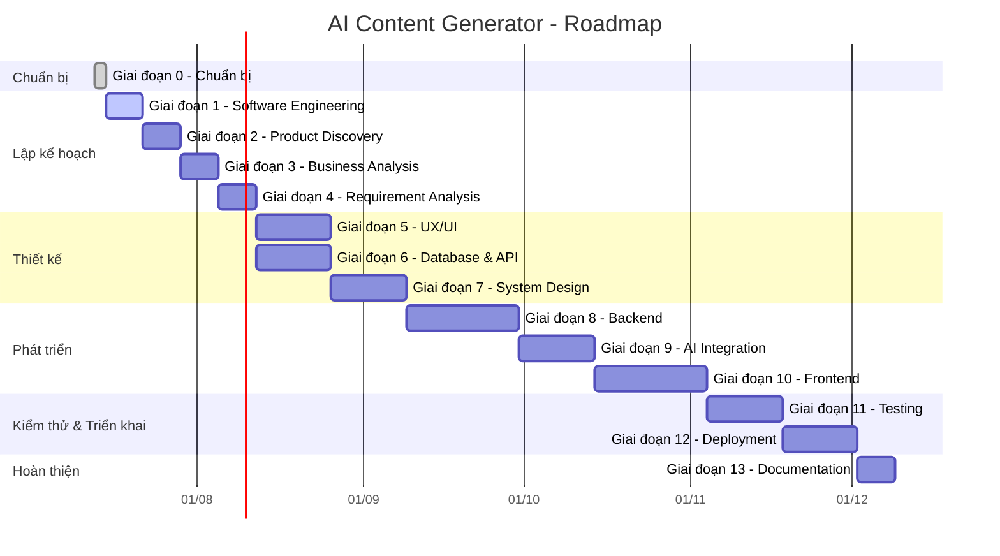
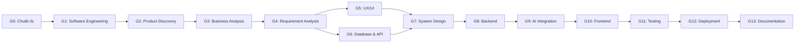

# AI Content Generator - Roadmap

## Tổng quan

- **Dự án**: AI Content Generator
- **Thời gian**: 24 tuần (~6 tháng)
- **Phương pháp**: Agile / Scrum

---

## Timeline

---

## Chi tiết các giai đoạn

### Giai đoạn 0 — Chuẩn bị (2 ngày)
| Mục tiêu | Deliverables |
|---|---|
| Thiết lập môi trường phát triển | Git, VS Code, IntelliJ, Postman, DBeaver |
| Cài đặt công cụ | Docker Desktop, MySQL/PostgreSQL |
| Tạo tài khoản | GitHub, Figma |

### Giai đoạn 1 — Software Engineering (1 tuần)
| Mục tiêu | Deliverables |
|---|---|
| Hiểu SDLC, Agile, Scrum, Kanban | Ghi chú |
| Áp dụng Git Flow | Roadmap, Sprint Plan |

### Giai đoạn 2 — Product Discovery (1 tuần)
| Mục tiêu | Deliverables |
|---|---|
| Xác định vấn đề & khách hàng mục tiêu | Vision Document |
| Phân tích đối thủ, SWOT | Competitor Analysis |
| Mô hình kinh doanh | Lean Canvas, Business Model Canvas |

### Giai đoạn 3 — Business Analysis (1 tuần)
| Mục tiêu | Deliverables |
|---|---|
| Xác định Stakeholder, Persona | BRD |
| Xây dựng User Journey, User Story, Use Case | Tài liệu phân tích nghiệp vụ |

### Giai đoạn 4 — Requirement Analysis (1 tuần)
| Mục tiêu | Deliverables |
|---|---|
| Phân tích Functional & Non-functional Requirements | SRS |
| Xác định Business Rules, Acceptance Criteria | Product Backlog |

### Giai đoạn 5 — UX/UI (2 tuần)
| Mục tiêu | Deliverables |
|---|---|
| Thiết kế Information Architecture, User Flow | Sitemap, Wireframe |
| Xây dựng Design System (Colors, Typography, Components) | Prototype (Figma) |
| Thiết kế Responsive | Giao diện hoàn thiện |

### Giai đoạn 6 — Database & API (2 tuần)
| Mục tiêu | Deliverables |
|---|---|
| Thiết kế ERD, Data Dictionary | SQL Script |
| Thiết kế REST API, Authentication Flow | OpenAPI/Swagger, Postman Collection |

### Giai đoạn 7 — System Design (2 tuần)
| Mục tiêu | Deliverables |
|---|---|
| High-Level Design (HLD) | Architecture Diagram |
| Low-Level Design (LLD) | Class Diagram, Sequence Diagram |

### Giai đoạn 8 — Backend (3 tuần)
| Mục tiêu | Deliverables |
|---|---|
| Xây dựng Spring Boot project | CRUD APIs |
| Authentication & Authorization (JWT) | Exception Handling, Logging |

### Giai đoạn 9 — AI Integration (2 tuần)
| Mục tiêu | Deliverables |
|---|---|
| Prompt Engineering, LLM API | Module tạo nội dung AI |
| Prompt Design | API tích hợp AI |

### Giai đoạn 10 — Frontend (3 tuần)
| Mục tiêu | Deliverables |
|---|---|
| Xây dựng React app | Login, Dashboard |
| Kết nối API | AI Generator, History, Profile |

### Giai đoạn 11 — Testing (2 tuần)
| Mục tiêu | Deliverables |
|---|---|
| Unit Test, Integration Test | Test Plan, Test Cases |
| API Test | Bug Report, Bug Fix |

### Giai đoạn 12 — Deployment (2 tuần)
| Mục tiêu | Deliverables |
|---|---|
| Docker, Docker Compose | CI/CD Pipeline |
| Deploy lên server | Domain, SSL |

### Giai đoạn 13 — Documentation (1 tuần)
| Mục tiêu | Deliverables |
|---|---|
| README, User Guide | API Documentation |
| Release Notes | Portfolio |

---

## Milestones

| Milestone | Thời gian | Mô tả |
|---|---|---|
| **M1: Foundation** | Tuần 1–2 | Hoàn thành Chuẩn bị & Software Engineering |
| **M2: Discovery** | Tuần 3–5 | Hoàn thành Product Discovery, Business Analysis, Requirement Analysis |
| **M3: Design** | Tuần 6–9 | Hoàn thành UX/UI, Database & API, System Design |
| **M4: Development** | Tuần 10–15 | Hoàn thành Backend, AI Integration, Frontend |
| **M5: Launch** | Tuần 16–19 | Hoàn thành Testing, Deployment |
| **M6: Delivery** | Tuần 20 | Hoàn thành Documentation & Portfolio |

---

## Dependency Graph

---

## Sprint Plan

| Sprint | Giai đoạn | Thời gian |
|---|---|---|
| Sprint 0 | G0 — Chuẩn bị | 2 ngày |
| Sprint 1 | G1 — Software Engineering | 1 tuần |
| Sprint 2 | G2 — Product Discovery | 1 tuần |
| Sprint 3 | G3 — Business Analysis | 1 tuần |
| Sprint 4 | G4 — Requirement Analysis | 1 tuần |
| Sprint 5–6 | G5 — UX/UI | 2 tuần |
| Sprint 7–8 | G6 — Database & API | 2 tuần |
| Sprint 9–10 | G7 — System Design | 2 tuần |
| Sprint 11–13 | G8 — Backend | 3 tuần |
| Sprint 14–15 | G9 — AI Integration | 2 tuần |
| Sprint 16–18 | G10 — Frontend | 3 tuần |
| Sprint 19–20 | G11 — Testing | 2 tuần |
| Sprint 21–22 | G12 — Deployment | 2 tuần |
| Sprint 23 | G13 — Documentation | 1 tuần |
