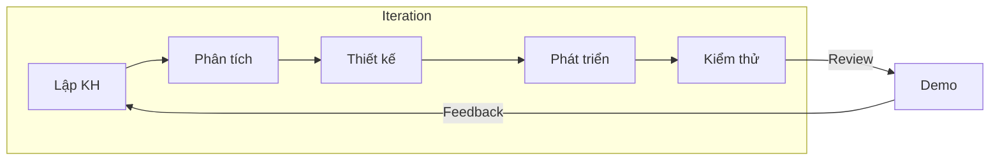

# Agile

## Agile là gì?

Agile là một triết lý phát triển phần mềm dựa trên sự **linh hoạt**, **cộng tác** và **phản hồi nhanh** với thay đổi. Thay vì làm tất cả từ đầu đến cuối như Waterfall, Agile chia dự án thành các vòng lặp nhỏ (iteration), mỗi vòng kéo dài 1–4 tuần.

---

## Agile Manifesto

4 giá trị cốt lõi:

| Giá trị | Mô tả |
|---|---|
| **Cá nhân và tương tác** | Quy trình và công cụ |
| **Phần mềm chạy được** | Tài liệu đầy đủ |
| **Hợp tác với khách hàng** | Đàm phán hợp đồng |
| **Phản hồi với thay đổi** | Bám sát kế hoạch |

---

## 12 Nguyên lý Agile

1. Ưu tiên cao nhất là thỏa mãn khách hàng thông qua việc **bàn giao sớm và liên tục** phần mềm có giá trị.
2. Chào đón thay đổi của yêu cầu, kể cả ở giai đoạn cuối.
3. Bàn giao phần mềm **thường xuyên**, từ vài tuần đến vài tháng.
4. **Business và Developer** làm việc cùng nhau hàng ngày.
5. Xây dựng dự án xung quanh những **cá nhân có động lực**.
6. Phương pháp hiệu quả nhất để truyền đạt thông tin là **trao đổi trực tiếp**.
7. **Phần mềm chạy được** là thước đo tiến độ chính.
8. Agile thúc đẩy **phát triển bền vững** — duy trì tốc độ đều đặn.
9. **Chú ý đến kỹ thuật tốt** và thiết kế tốt giúp tăng tính linh hoạt.
10. **Đơn giản** — nghệ thuật tối đa hóa lượng công việc không cần làm.
11. Kiến trúc, yêu cầu và thiết kế tốt nhất đến từ **các nhóm tự tổ chức**.
12. Nhóm **thường xuyên suy ngẫm** để điều chỉnh hành vi cho hiệu quả hơn.

---

## Quy trình Agile

### Vòng lặp Agile

1. **Lập kế hoạch** — Chọn user stories cho iteration, ước lượng
2. **Phát triển** — Code, unit test, integration
3. **Kiểm thử** — QA, bug fix
4. **Review/Demo** — Trình diễn cho stakeholder
5. **Retrospective** — Nhìn lại quy trình, cải tiến

---

## Các framework Agile phổ biến

### Scrum
Framework phổ biến nhất. Làm việc theo Sprint (1–4 tuần). Gồm: Product Owner, Scrum Master, Development Team.

### Kanban
Tập trung vào trực quan hóa luồng công việc, giới hạn WIP, tối ưu throughput.

### Extreme Programming (XP)
Nhấn mạnh kỹ thuật: TDD, Pair Programming, Continuous Integration, Refactoring.

### Lean
Loại bỏ lãng phí, tối đa giá trị cho khách hàng.

---

## Agile trong dự án AI Content Generator

Dự án áp dụng **Scrum** với Sprint 1 tuần. Mỗi Sprint bao gồm:

| Sự kiện | Thời gian |
|---|---|
| Sprint Planning | Đầu Sprint (1–2 giờ) |
| Daily Scrum | 15 phút mỗi ngày |
| Sprint Review | Cuối Sprint (1 giờ) |
| Sprint Retrospective | Cuối Sprint (1 giờ) |

**Sản phẩm**:
- Product Backlog — danh sách tất cả tính năng (G0–G13)
- Sprint Backlog — công việc của Sprint hiện tại
- Increment — kết quả sau mỗi Sprint
