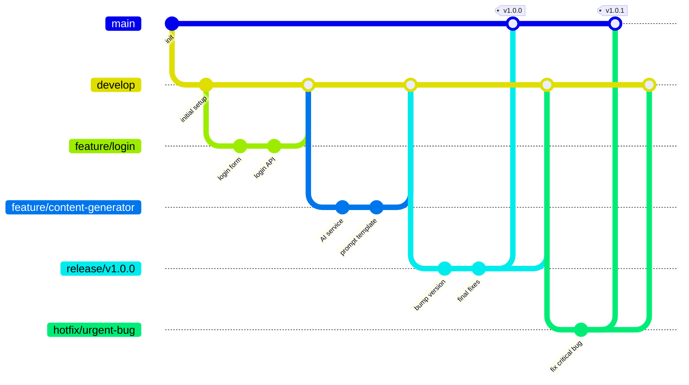
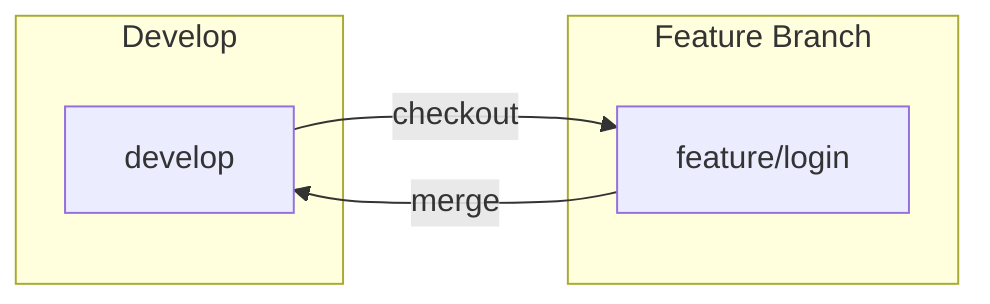
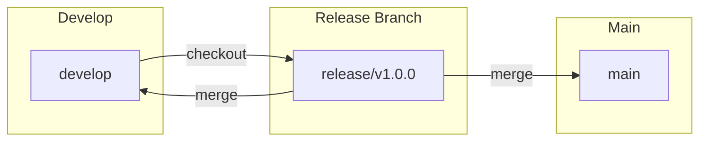
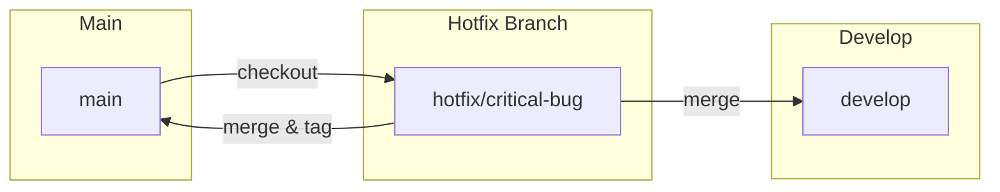

# Git Flow

## Git Flow là gì?

Git Flow là một mô hình quản lý branch (nhánh) cho Git, giúp tổ chức quy trình phát triển phần mềm một cách có hệ thống. Được Vincent Driessen giới thiệu năm 2010.



---

## Các nhánh chính

### Main Branch
- **Tên**: `main` (hoặc `master`)
- **Mục đích**: Chứa code đã release, sẵn sàng production
- **Quy tắc**: Không commit trực tiếp, chỉ nhận merge từ release hoặc hotfix

### Develop Branch
- **Tên**: `develop`
- **Mục đích**: Tích hợp các feature, code mới nhất
- **Quy tắc**: Nhận merge từ feature branches, là base cho release

---

## Các nhánh hỗ trợ

### Feature Branches
| Thuộc tính | Giá trị |
|---|---|
| **Tên** | `feature/<tên-tính-năng>` |
| **Branch gốc** | `develop` |
| **Merge vào** | `develop` |
| **Vòng đời** | Tồn tại khi đang phát triển tính năng |



### Release Branches
| Thuộc tính | Giá trị |
|---|---|
| **Tên** | `release/v<version>` |
| **Branch gốc** | `develop` |
| **Merge vào** | `main` + `develop` |
| **Vòng đời** | Chuẩn bị release (fix bug, bump version) |



### Hotfix Branches
| Thuộc tính | Giá trị |
|---|---|
| **Tên** | `hotfix/<mô-tả>` |
| **Branch gốc** | `main` |
| **Merge vào** | `main` + `develop` |
| **Vòng đời** | Sửa lỗi khẩn cấp trên production |



---

## Workflow

### 1. Phát triển tính năng mới
```bash
git checkout develop
git pull origin develop
git checkout -b feature/login
# ... code ...
git add .
git commit -m "feat: login form and API"
git checkout develop
git merge feature/login
git branch -d feature/login
git push origin develop
```

### 2. Chuẩn bị release
```bash
git checkout develop
git checkout -b release/v1.0.0
# fix bugs, bump version
git commit -m "chore: bump version to 1.0.0"
git checkout main
git merge release/v1.0.0
git tag v1.0.0
git push origin main --tags
git checkout develop
git merge release/v1.0.0
git push origin develop
git branch -d release/v1.0.0
```

### 3. Hotfix
```bash
git checkout main
git checkout -b hotfix/fix-login-bug
# fix critical bug
git commit -m "fix: resolve login error"
git checkout main
git merge hotfix/fix-login-bug
git tag v1.0.1
git push origin main --tags
git checkout develop
git merge hotfix/fix-login-bug
git push origin develop
git branch -d hotfix/fix-login-bug
```

---

## Commit Convention (Conventional Commits)

```
<type>: <short description>

[optional body]
[optional footer]
```

### Types
| Type | Ý nghĩa |
|---|---|
| `feat` | Tính năng mới |
| `fix` | Sửa lỗi |
| `docs` | Tài liệu |
| `style` | Format code (không ảnh hưởng logic) |
| `refactor` | Tái cấu trúc code |
| `test` | Thêm/sửa test |
| `chore` | Công việc maintenance |

### Ví dụ
```
feat: add login with JWT authentication
fix: handle empty content list on dashboard
docs: update API endpoints in README
refactor: extract content generation service
test: add unit tests for AIService
```

---

## Git Flow trong dự án AI Content Generator

### Cấu trúc branch cho dự án
```
main
├── develop
│   ├── feature/sdlc-document
│   ├── feature/product-discovery
│   ├── feature/ux-ui-design
│   ├── feature/database-design
│   ├── feature/backend-crud
│   ├── feature/ai-integration
│   └── feature/frontend-ui
├── release/v1.0.0
└── hotfix/fix-deployment-issue
```

### Quy tắc cho dự án

| Branch | Mục đích | Commit vào |
|---|---|---|
| `main` | Production code | Chỉ từ release/hotfix |
| `develop` | Tích hợp feature | Feature branches |
| `feature/*` | Từng tính năng | Dev |
| `release/*` | Chuẩn bị release | Bug fix, version bump |
| `hotfix/*` | Sửa lỗi khẩn | Critical fix |
