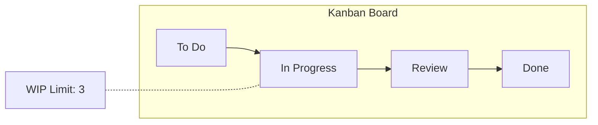
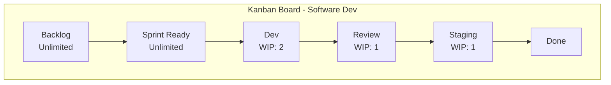
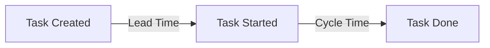

# Kanban

## Kanban là gì?

Kanban (看板 — "biển hiệu" trong tiếng Nhật) là một phương pháp quản lý công việc trực quan, tập trung vào **cải tiến liên tục** và **tối ưu luồng** (flow). Kanban không yêu cầu thay đổi cấu trúc team hiện tại, có thể áp dụng lên quy trình đang có.

---

## Nguyên lý cốt lõi

1. **Visualize workflow** — Trực quan hóa luồng công việc
2. **Limit WIP** (Work In Progress) — Giới hạn số lượng việc đang làm
3. **Manage flow** — Quản lý luồng công việc
4. **Make policies explicit** — Quy tắc rõ ràng
5. **Implement feedback loops** — Vòng phản hồi
6. **Improve collaboratively** — Cải tiến cùng nhau

---

## Kanban Board

### Cấu trúc cơ bản

| To Do | In Progress (WIP: 3) | Review (WIP: 2) | Done |
|---|---|---|---|
| Task A | Task D | Task F | Task H |
| Task B | Task E | | Task I |
| Task C | | | |

### Mở rộng cho dự án phần mềm

| Backlog | Sprint | Dev | Review | Staging | Done |
|---|---|---|---|---|---|
| Story 1 | Story 3 | Story 5 | Story 7 | Story 9 | Story 11 |
| Story 2 | Story 4 | Story 6 | Story 8 | Story 10 | |
| | | **WIP: 2** | **WIP: 1** | | |

---

## WIP Limit (Giới hạn công việc đang làm)

### Tại sao cần WIP Limit?

- **Tập trung** — Làm xong việc này mới làm việc khác
- **Giảm context switching** — Chuyển đổi qua lại tốn năng suất
- **Phát hiện sớm blocker** — Nếu cột bị tắc, team tập trung giải quyết
- **Tăng throughput** — Ít việc cùng lúc = hoàn thành nhanh hơn

### Cách đặt WIP

| Loại team | WIP gợi ý |
|---|---|
| 1 người | 2–3 |
| 3 người | 3–5 |
| 5+ người | 2/người |

---

## Metrics (Chỉ số)

### Cycle Time
Thời gian từ lúc bắt đầu đến lúc hoàn thành một task.

### Lead Time
Thời gian từ lúc task được tạo đến lúc hoàn thành.

### Throughput
Số task hoàn thành trong một khoảng thời gian (vd: task/tuần).

### CFD (Cumulative Flow Diagram)
Biểu đồ tích lũy thể hiện số lượng task ở từng trạng thái theo thời gian.

---

## Kanban vs Scrum

| Tiêu chí | Kanban | Scrum |
|---|---|---|
| **Vòng lặp** | Không cố định | Sprint (1–4 tuần) |
| **Vai trò** | Giữ nguyên vai trò hiện tại | PO, SM, Dev Team |
| **WIP Limit** | Có | Không (dựa trên cam kết) |
| **Thay đổi** | Có thể thêm task bất kỳ lúc nào | Không thay đổi trong Sprint |
| **Board** | Liên tục | Reset mỗi Sprint |
| **Ưu điểm** | Linh hoạt, ít thay đổi quy trình | Kỷ luật, predictble |
| **Phù hợp** | Support, Ops, Bảo trì | Phát triển sản phẩm |

---

## Kanban trong dự án AI Content Generator

Dự án chính sử dụng **Scrum**, nhưng có thể kết hợp Kanban để:

### Khi nào dùng Kanban?

- **Bug fixing** giữa Sprint — các bug nhỏ được xử lý qua Kanban board
- **Maintenance phase** (G13 về sau) — các cải tiến nhỏ
- **Personal task tracking** — theo dõi tiến độ cá nhân

### Ví dụ Kanban Board cho Sprint

| Backlog | Sprint (WIP: 2) | Dev (WIP: 1) | Review (WIP: 1) | Done |
|---|---|---|---|---|
| SRS hoàn thiện | UI Design | Login API | Database ERD | Roadmap |
| User Guide | | | | Checklist |
