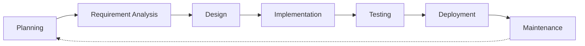
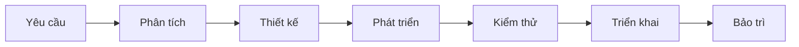
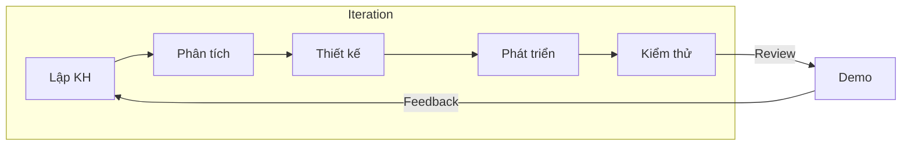
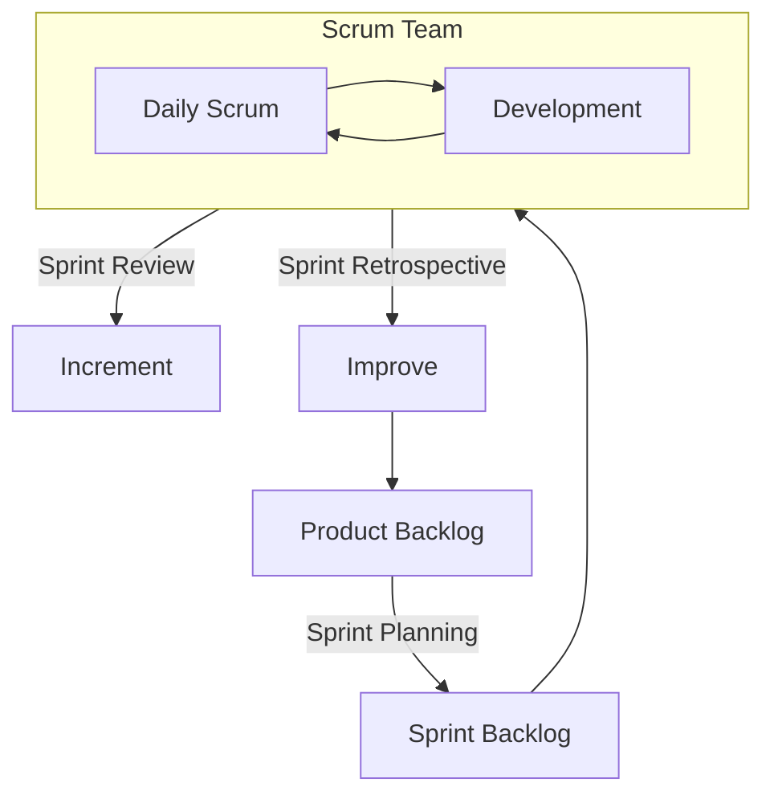

# Software Development Life Cycle (SDLC)

## SDLC là gì?

SDLC (Software Development Life Cycle) là quy trình chuẩn để xây dựng và bảo trì phần mềm, từ khi có ý tưởng đến khi phần mềm ngừng hoạt động.

**Mục tiêu**: Giảm thiểu rủi ro, quản lý tiến độ, kiểm soát chi phí, dễ bảo trì.

---

## Các giai đoạn SDLC

### 1. Planning (Lập kế hoạch)
- Xác định phạm vi, mục tiêu, rủi ro
- Ước lượng chi phí và thời gian
- Lập kế hoạch nguồn lực
- **Deliverables**: Project Plan, Risk Assessment

### 2. Requirement Analysis (Phân tích yêu cầu)
- Thu thập yêu cầu từ stakeholders
- Phân tích chức năng và phi chức năng
- **Deliverables**: SRS (Software Requirement Specification)

### 3. Design (Thiết kế)
- Thiết kế kiến trúc hệ thống
- Thiết kế cơ sở dữ liệu, giao diện, API
- **Deliverables**: HLD, LLD, ERD, Wireframe

### 4. Implementation (Phát triển)
- Viết code theo thiết kế
- Code review, unit test
- **Deliverables**: Source code, Unit test reports

### 5. Testing (Kiểm thử)
- Integration test, system test, UAT
- Bug fix
- **Deliverables**: Test Plan, Test Cases, Bug Report

### 6. Deployment (Triển khai)
- Deploy lên production
- Cấu hình môi trường, CI/CD
- **Deliverables**: Release Notes, Deployment Guide

### 7. Maintenance (Bảo trì)
- Sửa lỗi, nâng cấp tính năng
- Monitoring và support
- **Deliverables**: Bug fixes, Patch releases

## Tổng hợp các giai đoạn

| Giai đoạn | Mục tiêu | Đầu ra |
|---|---|---|
| Planning | Có nên làm dự án không | Project Charter, Roadmap |
| Requirement Analysis | Khách hàng muốn gì | SRS |
| Design | Hệ thống sẽ được xây như thế nào | HLD, LLD |
| Development | Viết code | Source Code |
| Testing | Kiểm tra phần mềm | Test Report |
| Deployment | Đưa lên Production | Release |
| Maintenance | Bảo trì | Patch |

---

## Mô hình phát triển

### Waterfall

Tuần tự từng giai đoạn, phù hợp dự án nhỏ, yêu cầu rõ ràng.

### Agile

Phát triển lặp, linh hoạt thay đổi, phù hợp dự án có yêu cầu thay đổi liên tục.

### Scrum

Framework Agile với các sự kiện: Sprint Planning, Daily Scrum, Sprint Review, Sprint Retrospective.

---

## Áp dụng vào dự án AI Content Generator

Dự án áp dụng **Agile/Scrum**, chia thành 14 giai đoạn nhỏ (từ Chuẩn bị đến Documentation) tương ứng với 7 giai đoạn SDLC truyền thống.

| SDLC Phase | Giai đoạn trong dự án |
|---|---|
| Planning | G0 + G1 (Chuẩn bị + Software Engineering) |
| Requirement Analysis | G2 + G3 + G4 (Product Discovery → Requirement Analysis) |
| Design | G5 + G6 + G7 (UX/UI → Database & API → System Design) |
| Implementation | G8 + G9 + G10 (Backend → AI → Frontend) |
| Testing | G11 (Testing) |
| Deployment | G12 (Deployment) |
| Maintenance | G13 (Documentation + về sau) |
