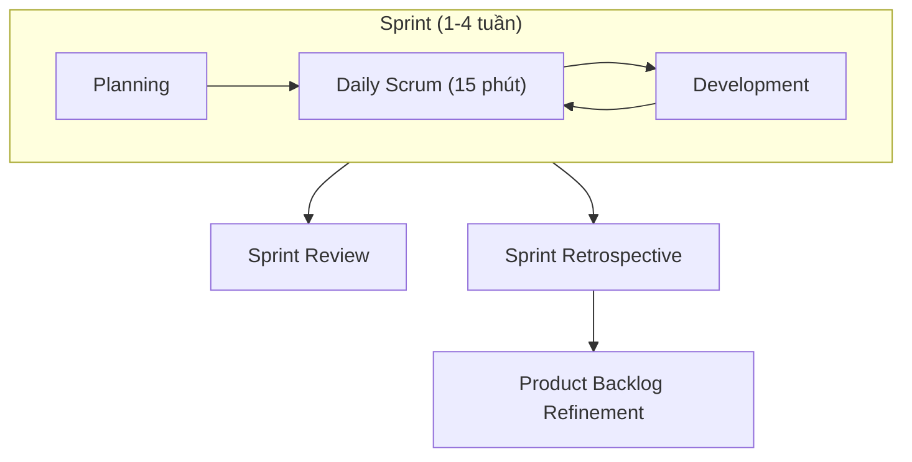
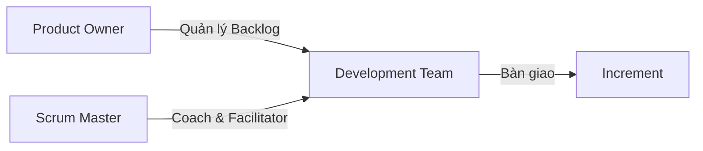
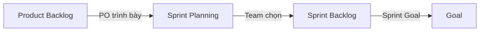
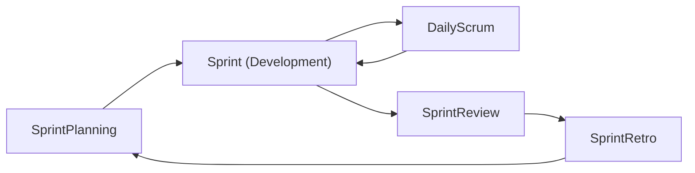

# Scrum

## Scrum là gì?

Scrum là một framework Agile giúp các nhóm phát triển phần mềm phức tạp thông qua các vòng lặp ngắn gọi là **Sprint**. Scrum dựa trên kinh nghiệm (empirical process) với ba trụ cột: **Minh bạch**, **Kiểm tra**, và **Thích ứng**.

---

## Ba trụ cột của Scrum

| Trụ cột | Mô tả |
|---|---|
| **Minh bạch (Transparency)** | Mọi người đều thấy trạng thái công việc qua Board, Burndown chart |
| **Kiểm tra (Inspection)** | Thường xuyên kiểm tra sản phẩm và quy trình (Daily Scrum, Review) |
| **Thích ứng (Adaptation)** | Điều chỉnh ngay khi phát hiện vấn đề (Retrospective) |

---

## Vai trò trong Scrum

### Product Owner (PO)
- Đại diện khách hàng
- Quản lý Product Backlog
- Xác định priority (giá trị kinh doanh)
- Chịu trách nhiệm ROI

### Scrum Master (SM)
- Huấn luyện viên Agile
- Đảm bảo Scrum được áp dụng đúng
- Gỡ bỏ blockers cho team
- Facilitator cho các sự kiện Scrum

### Development Team
- Tự tổ chức (self-organizing)
- Đa chức năng (cross-functional)
- 3–9 người
- Chịu trách nhiệm bàn giao Increment

---

## Sự kiện Scrum (Events)

### 1. Sprint Planning
- **Thời gian**: Đầu Sprint (tối đa 8 giờ cho Sprint 1 tháng)
- **Mục tiêu**: Xác định **Sprint Goal** và chọn user stories cho Sprint
- **Kết quả**: Sprint Backlog

### 2. Daily Scrum
- **Thời gian**: 15 phút mỗi ngày (cùng giờ, cùng địa điểm)
- **Câu hỏi**:
    - Hôm qua tôi đã làm gì?
    - Hôm nay tôi sẽ làm gì?
    - Có blocker gì không?
- **Mục tiêu**: Đồng bộ team, phát hiện sớm vấn đề

### 3. Sprint Review
- **Thời gian**: Cuối Sprint (tối đa 4 giờ cho Sprint 1 tháng)
- **Nội dung**:
    - Team demo những gì đã hoàn thành
    - PO cập nhật Product Backlog
    - Stakeholder feedback
- **Kết quả**: Product Backlog được cập nhật

### 4. Sprint Retrospective
- **Thời gian**: Sau Sprint Review (tối đa 3 giờ)
- **Nội dung**:
    - Điều gì tốt? Tiếp tục phát huy
    - Điều gì chưa tốt? Cải thiện
    - Action items cho Sprint sau
- **Mục tiêu**: Cải tiến liên tục (Kaizen)

---

## Artifacts (Sản phẩm)

### Product Backlog
- Danh sách tất cả tính năng, yêu cầu, cải tiến
- Do PO quản lý
- Luôn được ưu tiên lại (re-prioritize)
- **DONE**: Sẵn sàng cho Sprint Planning

| ID | Story | Priority | Effort | Status |
|---|---|---|---|---|
| PBI-1 | Đăng nhập | High | 5 | Ready |
| PBI-2 | Tạo content AI | High | 13 | Ready |
| PBI-3 | Lịch sử content | Medium | 8 | Refine |

### Sprint Backlog
- User stories được chọn cho Sprint hiện tại
- Team tự quản lý
- Có thể thêm task con (sub-task) trong quá trình Sprint
- **DONE**: Đáp ứng Definition of Done

### Increment
- Tổng hợp tất cả Product Backlog items hoàn thành trong Sprint
- Phải ở trạng thái có thể bàn giao (potentially releasable)
- **DONE**: Đáp ứng Definition of Done của team

---

## Definition of Done (DoD)

Ví dụ DoD của dự án:

- Code đã được review
- Unit test pass (coverage ≥ 70%)
- Integration test pass
- API test pass (Postman)
- Documentation cập nhật
- Chạy được trên môi trường staging
- PO đã accept

---

## Scrum trong dự án AI Content Generator

| Yếu tố | Áp dụng |
|---|---|
| Sprint length | 1 tuần |
| Sprint Planning | Đầu Sprint, 1–2 giờ |
| Daily Scrum | Sáng 9:00, 15 phút |
| Sprint Review | Cuối Sprint, 1 giờ |
| Sprint Retrospective | Cuối Sprint, 1 giờ |
| PO | Quản lý backlog dự án |
| Scrum Master | Theo dõi tiến độ, gỡ blocker |
| Dev Team | 1 người (full-stack) |

### Sprint Flow cho dự án

1. **PO** chuẩn bị Product Backlog (từ G0 đến G13)
2. **Sprint Planning**: chọn giai đoạn → chia thành user stories
3. **Daily Scrum**: cập nhật tiến độ hàng ngày
4. **Sprint Review**: kiểm tra deliverables so với DoD
5. **Sprint Retrospective**: rút kinh nghiệm cho Sprint sau
